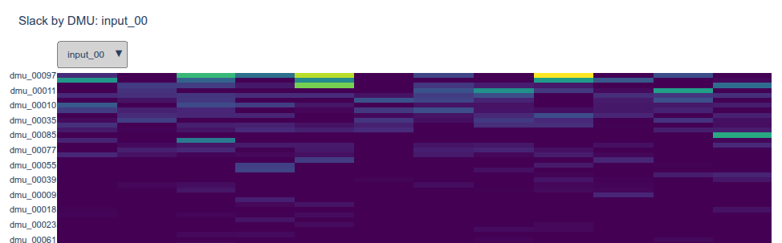
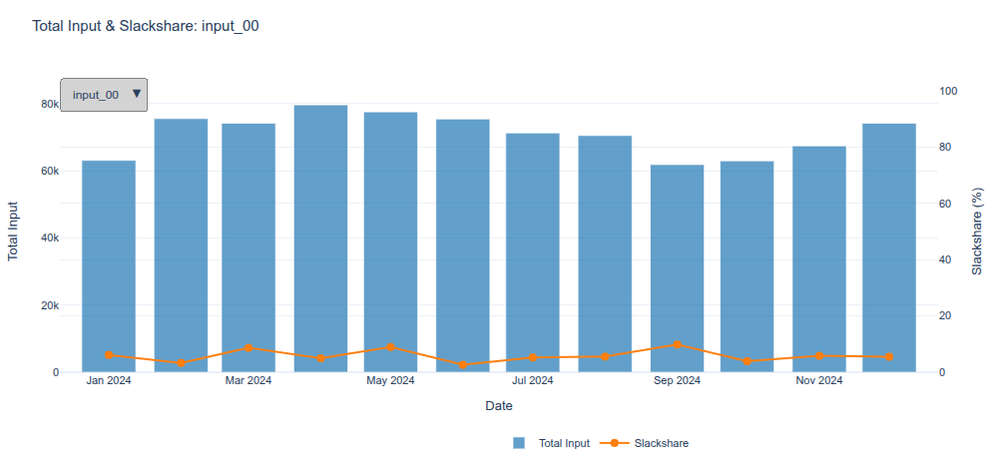

# slackshare

[](https://github.com/dmd0rf/slackshare/actions/workflows/ci.yml)

Input-oriented Free Disposal Hull (FDH) slack analysis for a single (typically undesirable) input, e.g. emissions, waste, energy use.

## Visual Overview

**Slack by DMU:** Each row is a decision-making unit (DMU). Color intensity represents avoidable input slack (purple = efficient, yellow = wasteful). Switch between 40 input types via the dropdown. Interactive: hover to see exact values and the benchmark peer DMU.



**[View interactive heatmap →](examples/slack_by_dmu.html)** (download and open in browser for full interactivity)

**Aggregate Trends:** Bars show total input consumption per month. The orange line shows slack share — the percentage of total input that is avoidable waste. This reveals whether your population is becoming more or less efficient over time.



**[View interactive chart →](examples/slack_share.html)** (download and open in browser for full interactivity)

## Quick Start (Panel Data)

For multi-date, multi-input-type workflows (the typical real-world case), use `analyze_panel`:

```python
import pandas as pd
import slackshare as ss

inputs = pd.DataFrame(
    {
        "dmu": ["A", "B", "C", "A", "B", "C"],
        "date": ["2024-01", "2024-01", "2024-01", "2024-02", "2024-02", "2024-02"],
        "input": ["emissions"] * 6,
        "value": [100, 80, 120, 90, 85, 110],
    }
)

outputs = pd.DataFrame(
    {
        "dmu": ["A", "B", "C", "A", "B", "C"],
        "date": ["2024-01", "2024-01", "2024-01", "2024-02", "2024-02", "2024-02"],
        "output": ["units_produced"] * 6,
        "value": [10, 10, 15, 11, 10, 15],
    }
)

per_dmu, summary = ss.analyze_panel(inputs, outputs)

print(per_dmu)
# dmu  date   input  units_produced  input_value  x_star  slack  efficient  ...
# A    2024-01  emissions  10      100.0    80.0      20.0  False
# B    2024-01  emissions  10      80.0     80.0      0.0  True
# C    2024-01  emissions  15      120.0   80.0      40.0  False
# ...

print(summary)
#     date   input  total_input  total_slack  slack_share
# 2024-01 emissions      300.0        60.0        0.20
# 2024-02 emissions      285.0        45.0        0.16
```

**Output columns:**

| per_dmu column | meaning |
|---|---|
| `dmu`, `date`, `input` | identifiers from your input data |
| `output_*` (all outputs from your data) | original output values |
| `x_star` | FDH-efficient input level for this (dmu, date, input_type) slice |
| `slack` | avoidable excess input (`value - x_star`); 0 means efficient |
| `efficient` | True if slack = 0 |
| `share_of_total_input` | this DMU's slack / total input in this slice |
| `share_of_total_slack` | this DMU's slack / total slack in this slice; indicates "how much of the waste does this DMU account for" |
| `peer` | identifier of the DMU that set the benchmark (`x_star`) for this DMU; among ties, alphabetically first |

| summary column | meaning |
|---|---|
| `date`, `input` | identifiers for the slice |
| `total_input` | sum of all input values in this slice (eligible DMUs only) |
| `total_slack` | sum of all slack values in this slice |
| `slack_share` | fraction of total input that is avoidable waste (`total_slack / total_input`) |

## Input Requirements

Before passing data to slackshare, it must satisfy these constraints. The library validates all of them and raises `ValueError` with clear messages if violated.

### Panel Format (`analyze_panel`)

Panel data is long-format (one row per dmu × date × input_type or output_type).

**input_df** — one row per dmu × date × input_type:

| Column | Type | NA allowed? | Constraints |
|---|---|---|---|
| `dmu` | str | **No** | Set of unique values must exactly match `output_df["dmu"]` (raises if mismatch) |
| `date` | str or datetime-like | **No** | Set of unique values must exactly match `output_df["date"]` (raises if mismatch) |
| `input` | str | **No** | Input-type label (e.g., "emissions", "energy", "waste"). Stack multiple input types as separate rows. |
| `value` | float | **Yes** — missing row or explicit NaN is allowed and treated as "this DMU ineligible for this (date,input) slice", not an error (unbalanced panel support) | When present: must be ≥ 0 (negative raises `ValueError`). |

Also required:
- No duplicate `(dmu, date, input)` combinations (raises `ValueError` — "ambiguous which value to use")

**output_df** — one row per dmu × date × output_type (same structure):

| Column | Type | NA allowed? | Constraints |
|---|---|---|---|
| `dmu` | str | **No** | Must match input_df's dmu set exactly |
| `date` | str or datetime-like | **No** | Must match input_df's date set exactly |
| `output` | str | **No** | Output-type label (e.g., "revenue", "units_produced") |
| `value` | float | **Yes** — missing row or NaN allowed for unbalanced panels | When present: must be ≥ 0 (negative raises `ValueError`). **Additional:** among all eligible DMUs in a (date, input_type) slice, no DMU may have all output values = 0 simultaneously (raises `ValueError` — violates FDH dominance) |

Also required:
- No duplicate `(dmu, date, output)` combinations

**Key difference from single-snapshot:** Panel format *tolerates and gracefully handles* missing/NaN values in the `value` column — the function marks that (dmu, date, type) as ineligible for the slice but does not error out. This is the "unbalanced panel" feature. Single-snapshot format does NOT tolerate NaN in inputs/outputs (see below).

### Single-Snapshot Format (`analyze`, `fdh_scores`)

Wide format, one row per DMU.

**data** — one row per DMU, one column per output:

| Column | Type | NA allowed? | Constraints |
|---|---|---|---|
| `input_col` (you choose the name, e.g., `"emissions"`) | float | **No** — raises `ValueError` if any NaN | Must be ≥ 0 (negative raises `ValueError`) |
| each output column (you choose names, e.g., `"revenue"`, `"units"`) | float | **No** — raises `ValueError` if any NaN | Must be ≥ 0; a single DMU cannot have 0 across *every* output column simultaneously (raises `ValueError`) |
| `id_col` (optional, you choose the name) | str or any | N/A (optional, omit if you don't need readable peer names) | If provided, used to label peers in output. If omitted, DataFrame index (stringified) is used instead. |

Also required:
- At least one row (empty DataFrame raises `ValueError`)

Use `analyze_panel` for multi-date/multi-input, or use `analyze`/`fdh_scores` directly if you have only one cross-section (single point in time) of data.

## Single-Snapshot API (Building Blocks)

If you have a single snapshot in time (no panel), or want finer control over the pipeline, use these functions directly.

```python
import pandas as pd
import slackshare as ss

data = pd.DataFrame(
    {
        "dmu": ["A", "B", "C", "D"],
        "emissions": [100, 80, 120, 60],
        "output": [10, 10, 15, 8],
    }
)

per_dmu, summary = ss.analyze(data, input_col="emissions", output_cols=["output"])
```

Multiple outputs (vector dominance) — pass a list:

```python
per_dmu, summary = ss.analyze(
    data,
    input_col="emissions",
    output_cols=["revenue", "quality_score"],
)
```

**What each output column means:**

| per_dmu column | meaning |
|---|---|
| `x_star` | FDH-efficient input level |
| `slack` | avoidable excess input (`x - x_star`) |
| `efficient` | True if `slack == 0` |
| `share_of_total_input` | `slack_i / sum(x_i)` |
| `share_of_total_slack` | `slack_i / sum(slack_i)` |
| `peer` | identifier of the DMU that achieves `x_star` for this DMU; among ties, alphabetically first |

**summary keys:** `total_input`, `total_slack`, `slack_share`.

### Step-by-step API

For advanced workflows, call the functions separately:

```python
scored = ss.fdh_scores(data, input_col="emissions", output_cols=["output"], id_col="dmu")
summary = ss.aggregate(scored, input_col="emissions")
with_shares = ss.dmu_shares(scored, input_col="emissions")
```

All functions require `input_col` to identify which column holds the input values.

Optional `id_col` (for `fdh_scores` and `analyze`) specifies which column contains DMU identifiers for peer identification; if omitted, uses DataFrame index.

## Concept (The Math)

For each DMU *i* with input $x_i$ and output vector $y_i$, `slackshare` computes input-oriented FDH (Free Disposal Hull) efficiency and slack:

$$x_i^{*} = \min\{x_j : y_j \ge y_i \text{ on every output dimension}\}$$

$$\text{slack}_i = x_i - x_i^{*}$$

where $x_i^*$ is the smallest input among all DMUs that *dominate* DMU *i* on every output dimension simultaneously (vector or Pareto dominance). The slack $\text{slack}_i$ is the avoidable excess input — how much the DMU could reduce input while maintaining its output performance.

FDH imposes only free disposability (no convexity), so a DMU is only compared against *actually observed* dominating units — never a hypothetical convex blend of several units.

`slackshare` then decomposes total input across all DMUs into aggregate and per-DMU measures:

**Aggregate decomposition:**
$$\text{slack\\_share} = \frac{\sum_i \text{slack}_i}{\sum_i x_i}$$

the proportion of total input across all DMUs that is avoidable excess.

**Per-DMU shares:**
- Share of total input: $\dfrac{\text{slack}_i}{\sum_i x_i}$ — DMU's slack as a fraction of the population's total input.
- Share of aggregate slack: $\dfrac{\text{slack}_i}{\sum_i \text{slack}_i}$ — how much of the system-wide waste this DMU accounts for.

## Install

```bash
pip install -e .
```

## Interactive Example

Run a complete end-to-end example that generates synthetic data, runs FDH analysis, and builds the two interactive HTML charts you see at the top.

### Setup

Install the optional dependencies:

```bash
pip install -e ".[example]"
```

### Run

```bash
python run_example.py
```

This generates a synthetic panel (500 DMUs, 40 input types, 12 output types across 12 monthly dates), runs FDH analysis, and builds two interactive HTML reports. Total runtime: ~10 seconds.

Outputs: `output/slack_by_dmu.html` and `output/slack_share.html`

### View the reports

Open the HTML files in your browser:

```bash
open output/slack_by_dmu.html      # macOS
xdg-open output/slack_by_dmu.html  # Linux
start output\slack_by_dmu.html     # Windows
```

The HTML files are fully self-contained and work offline.

### What you'll see

**output/slack_by_dmu.html** — Interactive heatmap showing slack (waste) for each DMU over time.
- X-axis: 12 monthly dates
- Y-axis: 500 DMUs (sorted by slack)
- Color: intensity of slack (purple = efficient, yellow = wasteful)
- Dropdown: switch between the 40 input types
- Hover: see exact DMU id, date, slack value, and the peer DMU that set the benchmark

**output/slack_share.html** — System-wide trend chart.
- Bars: total input consumption per date
- Line: slack share (% of input that is avoidable waste)
- Dropdown: switch between input types
- Hover: see exact values

### Scale up

To run on a larger dataset (slower, O(n²) runtime):

```bash
python run_example.py --n-dmus 2000  # ~30s
python run_example.py --n-dmus 5000  # ~3 minutes
```

## Development

Run tests with:
```bash
pytest
```

## Notes / scope (v0.1)

- Single (undesirable) input; one or more outputs via vector/Pareto dominance.
- No convexity assumption (this is FDH, not DEA) — so scores reflect pure technical/dominance-based inefficiency, not allocative or convexity-driven inefficiency.
- Panel data support via `analyze_panel` for multi-date, multi-input-type workflows.

## See also

- [paper](docs/paper.pdf) — Full formalization with worked examples and theoretical analysis.
